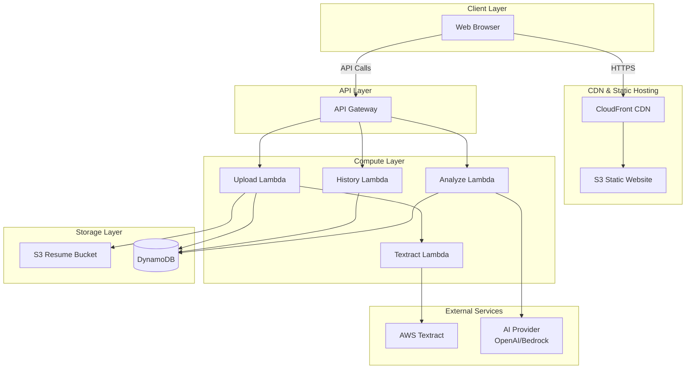
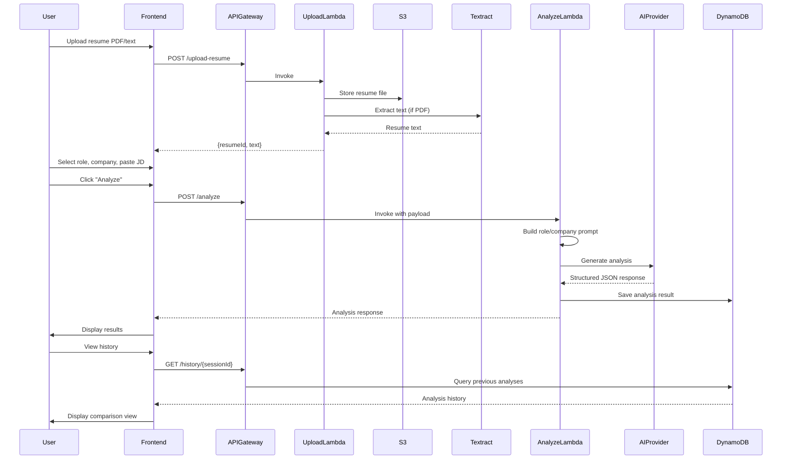

# Design Document: Resume Reviewer Web Application

## Overview

The Resume Reviewer is a production-ready web application that helps job candidates improve their resumes for specific target roles (SWE, QA, Data Analyst, Product Manager) and companies (Amazon, Google, Meta, Netflix, Apple). The system analyzes resumes against job descriptions, provides structured feedback with match scores, identifies skill gaps, rewrites weak bullet points, and offers actionable recommendations. Users can iterate on their resumes and compare improvements over time.

The application uses a serverless AWS architecture with a static frontend (HTML/CSS/JavaScript/minimal TypeScript) and backend services (S3, API Gateway, Lambda, Textract, DynamoDB, CloudFront). AI analysis is performed server-side using OpenAI or AWS-native LLMs, with a flexible provider abstraction for future swapping.

## Architecture

### System Architecture Diagram




### Main User Flow Sequence



## Components and Interfaces

### Frontend Components

#### ResumeUploader

**Purpose**: Handle resume file upload and text extraction

**Interface**:
```typescript
interface ResumeUploader {
  uploadFile(file: File): Promise<UploadResult>
  pasteText(text: string): void
  getResumeText(): string
  clear(): void
}

interface UploadResult {
  resumeId: string
  text: string
  fileName?: string
  pageCount?: number
}
```

**Responsibilities**:
- Accept PDF file uploads or pasted text
- Display upload progress and status
- Extract text from PDF using pdf.js (client-side fallback)
- Send file to backend for server-side extraction if needed
- Store extracted text in component state


#### RoleSelector

**Purpose**: Allow user to select target role

**Interface**:
```typescript
interface RoleSelector {
  selectRole(role: TargetRole): void
  getSelectedRole(): TargetRole | null
  getRoleDescription(role: TargetRole): string
}

type TargetRole = 
  | 'SWE' 
  | 'QA' 
  | 'DevOps' 
  | 'DataAnalyst' 
  | 'DataScientist' 
  | 'ProductManager' 
  | 'SecurityEngineer'
  | 'MLEngineer'
```

**Responsibilities**:
- Display role options with descriptions
- Track selected role
- Provide role-specific evaluation criteria hints

#### CompanySelector

**Purpose**: Allow user to select target company or company style

**Interface**:
```typescript
interface CompanySelector {
  selectCompany(company: TargetCompany): void
  getSelectedCompany(): TargetCompany | null
  getCompanyProfile(company: TargetCompany): CompanyProfile
}

type TargetCompany = 
  | 'Amazon' 
  | 'Google' 
  | 'Meta' 
  | 'Netflix' 
  | 'Apple'
  | 'Microsoft'
  | 'Generic'

interface CompanyProfile {
  name: string
  focusAreas: string[]
  culturalValues: string[]
  resumeStyle: string
}
```

**Responsibilities**:
- Display company options with profile hints
- Track selected company
- Provide company-specific evaluation hints

#### JobDescriptionInput

**Purpose**: Accept job description text or select sample JD

**Interface**:
```typescript
interface JobDescriptionInput {
  pasteJobDescription(text: string): void
  selectSampleJD(role: TargetRole, company: TargetCompany): void
  getJobDescription(): string
  clear(): void
}
```

**Responsibilities**:
- Accept pasted job description text
- Provide sample JD templates for common role/company combinations
- Validate JD is not empty before analysis


#### AnalysisSummaryCard

**Purpose**: Display overall score and summary

**Interface**:
```typescript
interface AnalysisSummaryCard {
  render(analysis: AnalysisResponse): void
  getScoreColor(score: number): string
  formatScoreExplanation(explanation: string): string
}
```

**Responsibilities**:
- Display overall resume score (0-100)
- Show color-coded score badge (red/amber/green)
- Display score explanation text
- Show keyword match score

#### KeywordGapPanel

**Purpose**: Display matching and missing skills

**Interface**:
```typescript
interface KeywordGapPanel {
  renderMatchingSkills(skills: string[]): void
  renderMissingSkills(skills: string[]): void
  highlightCriticalGaps(skills: string[]): void
}
```

**Responsibilities**:
- Display skills found in both resume and JD (green tags)
- Display skills in JD but not in resume (amber tags)
- Highlight critical missing skills
- Provide empty state when no gaps found

#### BulletRewriteList

**Purpose**: Display weak bullets with suggestions

**Interface**:
```typescript
interface BulletRewriteList {
  render(bullets: WeakBullet[]): void
  copyToClipboard(suggestion: string): void
  showDiff(original: string, suggestion: string): void
}

interface WeakBullet {
  original: string
  issue: string
  suggestion: string
}
```

**Responsibilities**:
- Display original bullet text
- Show identified issue with each bullet
- Display rewritten suggestion
- Provide copy-to-clipboard functionality
- Show side-by-side diff view


#### ProjectSuggestionsPanel

**Purpose**: Display recommended projects to close skill gaps

**Interface**:
```typescript
interface ProjectSuggestionsPanel {
  render(suggestions: ProjectSuggestion[]): void
  expandDetails(projectId: string): void
}

interface ProjectSuggestion {
  title: string
  description: string
  skillsCovered: string[]
  estimatedTime: string
  difficulty: 'Beginner' | 'Intermediate' | 'Advanced'
}
```

**Responsibilities**:
- Display 2-3 project recommendations
- Show skills each project would demonstrate
- Provide expandable details for each project
- Link to relevant resources or tutorials

#### VersionHistoryPanel

**Purpose**: Display previous analysis runs and enable comparison

**Interface**:
```typescript
interface VersionHistoryPanel {
  render(history: AnalysisHistory[]): void
  selectForComparison(analysisId1: string, analysisId2: string): void
  showScoreTrend(history: AnalysisHistory[]): void
}

interface AnalysisHistory {
  analysisId: string
  timestamp: string
  score: number
  targetRole: string
  targetCompany: string
}
```

**Responsibilities**:
- Display list of previous analyses with timestamps
- Show score trend over time
- Enable selection of two versions for comparison
- Display score delta between versions

### Backend Lambda Functions

#### UploadLambda

**Purpose**: Handle resume file uploads and text extraction

**Interface**:
```typescript
interface UploadLambdaEvent {
  httpMethod: 'POST'
  body: {
    file?: string // base64 encoded
    text?: string
    fileName?: string
  }
}

interface UploadLambdaResponse {
  statusCode: number
  body: {
    resumeId: string
    text: string
    s3Key?: string
    pageCount?: number
  }
}
```


**Responsibilities**:
- Validate file size and type
- Store file in S3 if provided
- Extract text using Textract for PDFs
- Generate unique resumeId
- Store metadata in DynamoDB
- Return extracted text to frontend

#### AnalyzeLambda

**Purpose**: Orchestrate resume analysis with AI provider

**Interface**:
```typescript
interface AnalyzeLambdaEvent {
  httpMethod: 'POST'
  body: AnalysisRequest
}

interface AnalysisRequest {
  resumeText: string
  jobDescription: string
  targetRole: TargetRole
  targetCompany: TargetCompany
  sessionId?: string
  resumeId?: string
}

interface AnalysisLambdaResponse {
  statusCode: number
  body: AnalysisResponse
}

interface AnalysisResponse {
  analysisId: string
  timestamp: string
  score: number
  scoreExplanation: string
  keywordScore: number
  matchingSkills: string[]
  missingSkills: string[]
  weakBullets: WeakBullet[]
  companyAdvice: string[]
  projectSuggestions: ProjectSuggestion[]
  skillGapGuidance: string
}
```

**Responsibilities**:
- Validate input payload
- Load role and company profiles
- Build role/company-specific prompt
- Call AI provider with retry logic
- Parse and validate AI response
- Save analysis result to DynamoDB
- Return structured response to frontend


#### HistoryLambda

**Purpose**: Retrieve analysis history for a session

**Interface**:
```typescript
interface HistoryLambdaEvent {
  httpMethod: 'GET'
  pathParameters: {
    sessionId: string
  }
  queryStringParameters?: {
    limit?: string
  }
}

interface HistoryLambdaResponse {
  statusCode: number
  body: {
    analyses: AnalysisHistory[]
    count: number
  }
}
```

**Responsibilities**:
- Query DynamoDB for session's analysis history
- Sort by timestamp descending
- Apply pagination if needed
- Return list of previous analyses

#### TextractLambda

**Purpose**: Extract text from PDF using AWS Textract

**Interface**:
```typescript
interface TextractLambdaEvent {
  s3Bucket: string
  s3Key: string
}

interface TextractLambdaResponse {
  text: string
  pageCount: number
  confidence: number
}
```

**Responsibilities**:
- Call AWS Textract API
- Handle async Textract job if document is large
- Parse Textract response
- Return extracted text with metadata

## Data Models

### Resume Metadata

```typescript
interface ResumeMetadata {
  resumeId: string // PK
  sessionId: string // GSI
  s3Key?: string
  fileName?: string
  uploadTimestamp: string
  textLength: number
  pageCount?: number
  extractionMethod: 'client' | 'textract'
}
```

**Validation Rules**:
- resumeId must be unique UUID
- textLength must be > 0 and < 50000 characters
- uploadTimestamp must be ISO 8601 format


### Analysis Result

```typescript
interface AnalysisResult {
  analysisId: string // PK
  sessionId: string // GSI
  resumeId: string
  timestamp: string // SK
  targetRole: TargetRole
  targetCompany: TargetCompany
  score: number
  scoreExplanation: string
  keywordScore: number
  matchingSkills: string[]
  missingSkills: string[]
  weakBullets: WeakBullet[]
  companyAdvice: string[]
  projectSuggestions: ProjectSuggestion[]
  skillGapGuidance: string
  promptVersion: string
  aiProvider: string
  aiModel: string
}
```

**Validation Rules**:
- analysisId must be unique UUID
- score must be 0-100
- keywordScore must be 0-100
- timestamp must be ISO 8601 format
- matchingSkills and missingSkills must be non-empty arrays
- weakBullets must have 0-10 items

### Role Profile

```typescript
interface RoleProfile {
  roleId: TargetRole // PK
  displayName: string
  description: string
  keySkills: string[]
  evaluationCriteria: {
    technicalDepth: number // weight 0-1
    impactMetrics: number
    leadershipSignals: number
    systemThinking: number
    domainExpertise: number
  }
  commonTools: string[]
  sampleBulletPatterns: string[]
}
```

**Validation Rules**:
- roleId must be valid TargetRole enum value
- evaluationCriteria weights must sum to 1.0
- keySkills must have at least 5 items


### Company Profile

```typescript
interface CompanyProfile {
  companyId: TargetCompany // PK
  displayName: string
  culturalValues: string[]
  resumeStyleGuide: {
    preferredBulletStyle: string
    emphasizeMetrics: boolean
    emphasizeLeadership: boolean
    emphasizeScale: boolean
    emphasizeInnovation: boolean
  }
  keywordPreferences: string[]
  avoidPhrases: string[]
  sampleSuccessfulBullets: string[]
}
```

**Validation Rules**:
- companyId must be valid TargetCompany enum value
- culturalValues must have at least 3 items
- keywordPreferences must have at least 5 items

## Algorithmic Pseudocode

### Main Analysis Algorithm

```pascal
ALGORITHM analyzeResume(request)
INPUT: request of type AnalysisRequest
OUTPUT: result of type AnalysisResponse

BEGIN
  ASSERT request.resumeText IS NOT EMPTY
  ASSERT request.jobDescription IS NOT EMPTY
  ASSERT request.targetRole IS VALID
  ASSERT request.targetCompany IS VALID
  
  // Step 1: Load profiles
  roleProfile ← loadRoleProfile(request.targetRole)
  companyProfile ← loadCompanyProfile(request.targetCompany)
  
  // Step 2: Build context-aware prompt
  prompt ← buildPrompt(
    request.resumeText,
    request.jobDescription,
    roleProfile,
    companyProfile
  )
  
  // Step 3: Call AI provider with retry
  maxRetries ← 3
  attempt ← 0
  aiResponse ← NULL
  
  WHILE attempt < maxRetries AND aiResponse IS NULL DO
    TRY
      aiResponse ← callAIProvider(prompt)
      ASSERT isValidJSON(aiResponse)
    CATCH error
      attempt ← attempt + 1
      IF attempt >= maxRetries THEN
        THROW AnalysisError("AI provider failed after retries")
      END IF
      WAIT exponentialBackoff(attempt)
    END TRY
  END WHILE
  
  // Step 4: Parse and validate response
  parsedResponse ← parseJSON(aiResponse)
  ASSERT parsedResponse.score >= 0 AND parsedResponse.score <= 100
  ASSERT parsedResponse.matchingSkills IS ARRAY
  ASSERT parsedResponse.missingSkills IS ARRAY
  
  // Step 5: Enrich with company-specific advice
  parsedResponse.companyAdvice ← generateCompanyAdvice(
    parsedResponse,
    companyProfile
  )
  
  // Step 6: Generate project suggestions
  parsedResponse.projectSuggestions ← generateProjectSuggestions(
    parsedResponse.missingSkills,
    roleProfile
  )
  
  // Step 7: Save to database
  analysisId ← generateUUID()
  timestamp ← getCurrentTimestamp()
  
  analysisResult ← {
    analysisId: analysisId,
    sessionId: request.sessionId,
    resumeId: request.resumeId,
    timestamp: timestamp,
    ...parsedResponse
  }
  
  saveToDatabase(analysisResult)
  
  RETURN analysisResult
END
```


**Preconditions**:
- request contains valid resumeText (non-empty, < 50000 chars)
- request contains valid jobDescription (non-empty, < 20000 chars)
- targetRole exists in role profiles
- targetCompany exists in company profiles
- AI provider is available and configured

**Postconditions**:
- Returns valid AnalysisResponse with all required fields
- score is between 0 and 100
- analysisResult is persisted to DynamoDB
- No side effects on input parameters

**Loop Invariants**:
- attempt counter increases monotonically
- attempt never exceeds maxRetries
- aiResponse remains NULL until successful call

### Prompt Building Algorithm

```pascal
ALGORITHM buildPrompt(resumeText, jobDescription, roleProfile, companyProfile)
INPUT: resumeText, jobDescription, roleProfile, companyProfile
OUTPUT: prompt of type string

BEGIN
  ASSERT resumeText IS NOT EMPTY
  ASSERT jobDescription IS NOT EMPTY
  
  // Step 1: Build role-specific evaluation criteria
  criteriaSection ← ""
  FOR EACH criterion IN roleProfile.evaluationCriteria DO
    weight ← criterion.weight * 100
    criteriaSection ← criteriaSection + 
      "- " + criterion.name + " (" + weight + "% weight)\n"
  END FOR
  
  // Step 2: Build company-specific guidance
  companySection ← ""
  companySection ← companySection + "Company: " + companyProfile.displayName + "\n"
  companySection ← companySection + "Cultural Values:\n"
  FOR EACH value IN companyProfile.culturalValues DO
    companySection ← companySection + "- " + value + "\n"
  END FOR
  
  // Step 3: Build keyword preferences
  keywordSection ← ""
  FOR EACH keyword IN companyProfile.keywordPreferences DO
    keywordSection ← keywordSection + keyword + ", "
  END FOR
  
  // Step 4: Assemble complete prompt
  prompt ← TEMPLATE(
    systemRole: "You are a resume coach specializing in " + roleProfile.displayName + 
                " roles at " + companyProfile.displayName,
    evaluationCriteria: criteriaSection,
    companyGuidance: companySection,
    preferredKeywords: keywordSection,
    resumeText: resumeText,
    jobDescription: jobDescription,
    outputSchema: JSON_SCHEMA
  )
  
  RETURN prompt
END
```

**Preconditions**:
- All input parameters are non-null
- roleProfile contains valid evaluationCriteria
- companyProfile contains valid culturalValues and keywordPreferences

**Postconditions**:
- Returns non-empty prompt string
- Prompt contains all required sections
- Prompt is properly formatted for AI provider

**Loop Invariants**:
- criteriaSection accumulates valid criterion strings
- companySection accumulates valid value strings
- String concatenation maintains proper formatting


### Keyword Extraction Algorithm

```pascal
ALGORITHM extractKeywords(text, roleProfile)
INPUT: text of type string, roleProfile of type RoleProfile
OUTPUT: keywords of type string[]

BEGIN
  ASSERT text IS NOT EMPTY
  
  // Step 1: Normalize text
  normalizedText ← toLowerCase(text)
  normalizedText ← removeSpecialCharacters(normalizedText)
  
  // Step 2: Extract candidate keywords
  words ← splitIntoWords(normalizedText)
  phrases ← extractNGrams(normalizedText, 2, 3) // 2-3 word phrases
  
  candidates ← words + phrases
  
  // Step 3: Filter against role profile
  keywords ← []
  FOR EACH candidate IN candidates DO
    IF candidate IN roleProfile.keySkills OR 
       candidate IN roleProfile.commonTools THEN
      IF candidate NOT IN keywords THEN
        keywords.append(candidate)
      END IF
    END IF
  END FOR
  
  // Step 4: Sort by relevance
  keywords ← sortByFrequency(keywords, text)
  
  RETURN keywords
END
```

**Preconditions**:
- text is non-empty string
- roleProfile contains valid keySkills and commonTools arrays

**Postconditions**:
- Returns array of unique keywords
- Keywords are sorted by frequency in text
- All returned keywords exist in role profile

**Loop Invariants**:
- keywords array contains no duplicates
- All items in keywords exist in roleProfile

### Version Comparison Algorithm

```pascal
ALGORITHM compareVersions(analysisId1, analysisId2)
INPUT: analysisId1, analysisId2 of type string
OUTPUT: comparison of type VersionComparison

BEGIN
  ASSERT analysisId1 IS NOT EMPTY
  ASSERT analysisId2 IS NOT EMPTY
  
  // Step 1: Fetch both analyses
  analysis1 ← fetchFromDatabase(analysisId1)
  analysis2 ← fetchFromDatabase(analysisId2)
  
  ASSERT analysis1 IS NOT NULL
  ASSERT analysis2 IS NOT NULL
  
  // Step 2: Calculate score delta
  scoreDelta ← analysis2.score - analysis1.score
  
  // Step 3: Compare skills
  newMatchingSkills ← analysis2.matchingSkills - analysis1.matchingSkills
  resolvedGaps ← analysis1.missingSkills - analysis2.missingSkills
  newGaps ← analysis2.missingSkills - analysis1.missingSkills
  
  // Step 4: Compare bullets
  improvedBullets ← []
  FOR EACH bullet2 IN analysis2.weakBullets DO
    found ← FALSE
    FOR EACH bullet1 IN analysis1.weakBullets DO
      IF bullet1.original = bullet2.original THEN
        found ← TRUE
        BREAK
      END IF
    END FOR
    IF NOT found THEN
      improvedBullets.append(bullet2.original)
    END IF
  END FOR
  
  // Step 5: Build comparison result
  comparison ← {
    scoreDelta: scoreDelta,
    scoreImprovement: scoreDelta > 0,
    newMatchingSkills: newMatchingSkills,
    resolvedGaps: resolvedGaps,
    newGaps: newGaps,
    improvedBullets: improvedBullets,
    timestamp1: analysis1.timestamp,
    timestamp2: analysis2.timestamp
  }
  
  RETURN comparison
END
```

**Preconditions**:
- Both analysisIds exist in database
- Both analyses belong to same session
- analysis2.timestamp > analysis1.timestamp

**Postconditions**:
- Returns valid VersionComparison object
- scoreDelta accurately reflects difference
- All skill arrays contain unique items
- No modifications to stored analyses

**Loop Invariants**:
- improvedBullets contains only bullets not in analysis1
- found flag correctly tracks bullet existence


## Key Functions with Formal Specifications

### Function 1: validateAnalysisRequest()

```typescript
function validateAnalysisRequest(request: AnalysisRequest): ValidationResult
```

**Preconditions**:
- request object is defined (not null/undefined)
- request contains resumeText, jobDescription, targetRole, targetCompany fields

**Postconditions**:
- Returns ValidationResult with isValid boolean
- If invalid, returns array of specific error messages
- No mutations to request parameter
- Validation is idempotent (same input always produces same output)

**Loop Invariants**: N/A (no loops)

### Function 2: callAIProvider()

```typescript
function callAIProvider(prompt: string, config: AIConfig): Promise<string>
```

**Preconditions**:
- prompt is non-empty string
- config contains valid provider credentials
- config.maxTokens > 0
- config.temperature is between 0 and 1

**Postconditions**:
- Returns Promise that resolves to JSON string
- Throws error if API call fails after retries
- Does not modify prompt or config parameters
- Response conforms to expected schema

**Loop Invariants**: N/A (async operation)

### Function 3: parseAIResponse()

```typescript
function parseAIResponse(response: string): AnalysisResponse
```

**Preconditions**:
- response is non-empty string
- response contains valid JSON

**Postconditions**:
- Returns AnalysisResponse object with all required fields
- Throws ParseError if JSON is invalid or missing required fields
- All numeric fields are within valid ranges
- All array fields are properly typed

**Loop Invariants**: N/A (no loops)

### Function 4: saveAnalysisResult()

```typescript
function saveAnalysisResult(result: AnalysisResult): Promise<void>
```

**Preconditions**:
- result contains valid analysisId (UUID format)
- result contains valid timestamp (ISO 8601 format)
- result.score is between 0 and 100
- DynamoDB table exists and is accessible

**Postconditions**:
- Analysis result is persisted to DynamoDB
- Returns Promise that resolves on success
- Throws error if database write fails
- Result can be retrieved using analysisId

**Loop Invariants**: N/A (single database operation)


### Function 5: generateProjectSuggestions()

```typescript
function generateProjectSuggestions(
  missingSkills: string[], 
  roleProfile: RoleProfile
): ProjectSuggestion[]
```

**Preconditions**:
- missingSkills is an array (may be empty)
- roleProfile contains valid keySkills array
- roleProfile contains valid commonTools array

**Postconditions**:
- Returns array of 0-3 ProjectSuggestion objects
- Each suggestion covers at least 2 missing skills
- Suggestions are sorted by number of skills covered (descending)
- No duplicate suggestions
- If missingSkills is empty, returns empty array

**Loop Invariants**:
- All generated suggestions cover at least 2 skills from missingSkills
- No suggestion is added twice to result array
- Skill coverage count is accurate for each suggestion

## Example Usage

### Example 1: Basic Analysis Flow

```typescript
// Frontend: User uploads resume and initiates analysis
const resumeText = await uploadResume(file)
const request: AnalysisRequest = {
  resumeText: resumeText,
  jobDescription: jobDescriptionInput.value,
  targetRole: 'SWE',
  targetCompany: 'Amazon',
  sessionId: getSessionId()
}

// Call backend API
const response = await fetch('/api/analyze', {
  method: 'POST',
  headers: { 'Content-Type': 'application/json' },
  body: JSON.stringify(request)
})

const analysis: AnalysisResponse = await response.json()

// Display results
displayScore(analysis.score, analysis.scoreExplanation)
displayKeywordGaps(analysis.matchingSkills, analysis.missingSkills)
displayBulletRewrites(analysis.weakBullets)
displayProjectSuggestions(analysis.projectSuggestions)
```

### Example 2: Backend Lambda Handler

```typescript
// Lambda: Handle analysis request
export async function handler(event: APIGatewayEvent): Promise<APIGatewayResponse> {
  try {
    // Parse and validate request
    const request: AnalysisRequest = JSON.parse(event.body)
    const validation = validateAnalysisRequest(request)
    
    if (!validation.isValid) {
      return {
        statusCode: 400,
        body: JSON.stringify({ errors: validation.errors })
      }
    }
    
    // Load profiles
    const roleProfile = await loadRoleProfile(request.targetRole)
    const companyProfile = await loadCompanyProfile(request.targetCompany)
    
    // Build prompt and call AI
    const prompt = buildPrompt(
      request.resumeText,
      request.jobDescription,
      roleProfile,
      companyProfile
    )
    
    const aiResponse = await callAIProvider(prompt, {
      provider: 'openai',
      model: 'gpt-4o',
      temperature: 0.4,
      maxTokens: 2000
    })
    
    // Parse and enrich response
    const analysis = parseAIResponse(aiResponse)
    analysis.companyAdvice = generateCompanyAdvice(analysis, companyProfile)
    analysis.projectSuggestions = generateProjectSuggestions(
      analysis.missingSkills,
      roleProfile
    )
    
    // Save to database
    const result: AnalysisResult = {
      analysisId: generateUUID(),
      sessionId: request.sessionId,
      timestamp: new Date().toISOString(),
      ...analysis
    }
    
    await saveAnalysisResult(result)
    
    return {
      statusCode: 200,
      body: JSON.stringify(result)
    }
  } catch (error) {
    console.error('Analysis failed:', error)
    return {
      statusCode: 500,
      body: JSON.stringify({ error: 'Analysis failed' })
    }
  }
}
```


### Example 3: Version Comparison

```typescript
// Frontend: Compare two resume versions
const history = await fetchAnalysisHistory(sessionId)

// User selects two versions to compare
const comparison = await compareVersions(
  history[0].analysisId,  // Latest version
  history[2].analysisId   // Earlier version
)

// Display comparison
if (comparison.scoreImprovement) {
  displayMessage(`Score improved by ${comparison.scoreDelta} points!`)
}

displayNewSkills(comparison.newMatchingSkills)
displayResolvedGaps(comparison.resolvedGaps)
displayImprovedBullets(comparison.improvedBullets)
```

### Example 4: Prompt Template

```typescript
// Backend: Build role and company-specific prompt
function buildPrompt(
  resumeText: string,
  jobDescription: string,
  roleProfile: RoleProfile,
  companyProfile: CompanyProfile
): string {
  return `You are a resume coach specializing in ${roleProfile.displayName} roles at ${companyProfile.displayName}.

Analyze the resume against the job description using these evaluation criteria:
${roleProfile.evaluationCriteria.map(c => `- ${c.name}: ${c.weight * 100}% weight`).join('\n')}

Company Cultural Values:
${companyProfile.culturalValues.map(v => `- ${v}`).join('\n')}

Preferred Keywords: ${companyProfile.keywordPreferences.join(', ')}

Avoid Phrases: ${companyProfile.avoidPhrases.join(', ')}

Return ONLY valid JSON with this schema:
{
  "score": <0-100>,
  "scoreExplanation": "<2-3 sentences>",
  "keywordScore": <0-100>,
  "matchingSkills": ["<skill>", ...],
  "missingSkills": ["<skill>", ...],
  "weakBullets": [
    {
      "original": "<text>",
      "issue": "<problem>",
      "suggestion": "<rewrite>"
    }
  ],
  "skillGapGuidance": "<1-2 sentences>"
}

RESUME:
${resumeText}

JOB DESCRIPTION:
${jobDescription}`
}
```

## API Design

### REST Endpoints

#### POST /api/upload-resume

**Purpose**: Upload resume file or text

**Request**:
```typescript
{
  file?: string // base64 encoded PDF
  text?: string // plain text
  fileName?: string
  sessionId?: string
}
```

**Response**:
```typescript
{
  resumeId: string
  text: string
  s3Key?: string
  pageCount?: number
}
```

**Status Codes**:
- 200: Success
- 400: Invalid request (missing file/text, invalid format)
- 413: File too large (> 5MB)
- 500: Server error


#### POST /api/analyze

**Purpose**: Analyze resume against job description

**Request**:
```typescript
{
  resumeText: string
  jobDescription: string
  targetRole: TargetRole
  targetCompany: TargetCompany
  sessionId?: string
  resumeId?: string
}
```

**Response**:
```typescript
{
  analysisId: string
  timestamp: string
  score: number
  scoreExplanation: string
  keywordScore: number
  matchingSkills: string[]
  missingSkills: string[]
  weakBullets: WeakBullet[]
  companyAdvice: string[]
  projectSuggestions: ProjectSuggestion[]
  skillGapGuidance: string
}
```

**Status Codes**:
- 200: Success
- 400: Invalid request (missing fields, invalid role/company)
- 429: Rate limit exceeded
- 500: Server error
- 503: AI provider unavailable

#### GET /api/history/{sessionId}

**Purpose**: Retrieve analysis history for a session

**Query Parameters**:
- limit?: number (default 10, max 50)
- offset?: number (default 0)

**Response**:
```typescript
{
  analyses: AnalysisHistory[]
  count: number
  hasMore: boolean
}
```

**Status Codes**:
- 200: Success
- 400: Invalid sessionId
- 404: Session not found
- 500: Server error

#### GET /api/analysis/{analysisId}

**Purpose**: Retrieve a specific analysis result

**Response**:
```typescript
{
  analysisId: string
  sessionId: string
  resumeId: string
  timestamp: string
  targetRole: TargetRole
  targetCompany: TargetCompany
  score: number
  // ... all analysis fields
}
```

**Status Codes**:
- 200: Success
- 404: Analysis not found
- 500: Server error

#### POST /api/compare

**Purpose**: Compare two analysis versions

**Request**:
```typescript
{
  analysisId1: string
  analysisId2: string
}
```

**Response**:
```typescript
{
  scoreDelta: number
  scoreImprovement: boolean
  newMatchingSkills: string[]
  resolvedGaps: string[]
  newGaps: string[]
  improvedBullets: string[]
  timestamp1: string
  timestamp2: string
}
```

**Status Codes**:
- 200: Success
- 400: Invalid analysisIds
- 404: One or both analyses not found
- 500: Server error


## Frontend Structure

### File Organization

```
/frontend
├── index.html                 # Main application page
├── history.html              # Analysis history and comparison page
├── /styles
│   ├── base.css              # Reset, typography, colors
│   ├── layout.css            # Grid, containers, responsive
│   ├── components.css        # Buttons, cards, forms, tags
│   └── animations.css        # Transitions, loading states
├── /scripts
│   ├── app.js                # Main application logic
│   ├── api.js                # API client wrapper
│   ├── upload.js             # Resume upload and PDF extraction
│   ├── analysis.js           # Analysis request and display
│   ├── history.js            # History and comparison logic
│   ├── state.js              # Application state management
│   └── utils.js              # Helper functions
├── /types
│   ├── analysis.ts           # Analysis types and interfaces
│   ├── api.ts                # API request/response types
│   └── state.ts              # State management types
└── /assets
    ├── /icons                # SVG icons
    └── /samples              # Sample resumes and JDs
```

### State Management

```typescript
// state.js - Simple state management without framework
interface AppState {
  session: {
    sessionId: string
    resumeId?: string
    resumeText?: string
  }
  analysis: {
    loading: boolean
    current?: AnalysisResponse
    error?: string
  }
  history: {
    analyses: AnalysisHistory[]
    selectedForComparison: string[]
  }
  ui: {
    selectedRole?: TargetRole
    selectedCompany?: TargetCompany
    jobDescription?: string
  }
}

// Simple pub-sub for state updates
const state: AppState = initializeState()
const listeners: Map<string, Function[]> = new Map()

function setState(path: string, value: any): void {
  // Update state
  setNestedValue(state, path, value)
  
  // Notify listeners
  const pathListeners = listeners.get(path) || []
  pathListeners.forEach(listener => listener(value))
}

function subscribe(path: string, listener: Function): () => void {
  if (!listeners.has(path)) {
    listeners.set(path, [])
  }
  listeners.get(path).push(listener)
  
  // Return unsubscribe function
  return () => {
    const pathListeners = listeners.get(path)
    const index = pathListeners.indexOf(listener)
    if (index > -1) {
      pathListeners.splice(index, 1)
    }
  }
}
```

### Component Pattern

```typescript
// Example component pattern without framework
class AnalysisSummaryCard {
  private container: HTMLElement
  
  constructor(containerId: string) {
    this.container = document.getElementById(containerId)
    this.setupEventListeners()
  }
  
  render(analysis: AnalysisResponse): void {
    const scoreColor = this.getScoreColor(analysis.score)
    
    this.container.innerHTML = `
      <div class="score-card">
        <div class="score-badge ${scoreColor}">
          ${analysis.score}
        </div>
        <div class="score-text">
          <h2>Resume Presentation Score</h2>
          <p>${analysis.scoreExplanation}</p>
        </div>
      </div>
    `
  }
  
  getScoreColor(score: number): string {
    if (score >= 75) return 'good'
    if (score >= 50) return 'mid'
    return 'low'
  }
  
  private setupEventListeners(): void {
    // Setup any interactive elements
  }
}
```


## Backend Implementation

### Lambda Function Structure

```
/backend
├── /lambdas
│   ├── /upload
│   │   ├── handler.ts        # Upload Lambda entry point
│   │   ├── s3.ts             # S3 operations
│   │   └── textract.ts       # Textract integration
│   ├── /analyze
│   │   ├── handler.ts        # Analyze Lambda entry point
│   │   ├── prompt.ts         # Prompt building logic
│   │   ├── ai-provider.ts    # AI provider abstraction
│   │   └── enrichment.ts     # Response enrichment
│   ├── /history
│   │   ├── handler.ts        # History Lambda entry point
│   │   └── query.ts          # DynamoDB queries
│   └── /compare
│       ├── handler.ts        # Compare Lambda entry point
│       └── diff.ts           # Version comparison logic
├── /shared
│   ├── /models               # Shared data models
│   ├── /utils                # Shared utilities
│   ├── /validation           # Input validation
│   └── /database             # DynamoDB client wrapper
├── /profiles
│   ├── roles.json            # Role profile definitions
│   └── companies.json        # Company profile definitions
└── /config
    ├── api-gateway.yaml      # API Gateway configuration
    ├── dynamodb.yaml         # DynamoDB table definitions
    └── iam-policies.yaml     # IAM role policies
```

### AI Provider Abstraction

```typescript
// ai-provider.ts - Flexible provider interface
interface AIProvider {
  name: string
  call(prompt: string, config: AIConfig): Promise<string>
  validateConfig(config: AIConfig): boolean
}

interface AIConfig {
  model: string
  temperature: number
  maxTokens: number
  apiKey?: string
  region?: string
}

class OpenAIProvider implements AIProvider {
  name = 'openai'
  
  async call(prompt: string, config: AIConfig): Promise<string> {
    const response = await fetch('https://api.openai.com/v1/chat/completions', {
      method: 'POST',
      headers: {
        'Content-Type': 'application/json',
        'Authorization': `Bearer ${config.apiKey}`
      },
      body: JSON.stringify({
        model: config.model,
        temperature: config.temperature,
        max_tokens: config.maxTokens,
        messages: [{ role: 'user', content: prompt }]
      })
    })
    
    const data = await response.json()
    return data.choices[0].message.content
  }
  
  validateConfig(config: AIConfig): boolean {
    return !!(config.apiKey && config.model)
  }
}

class BedrockProvider implements AIProvider {
  name = 'bedrock'
  
  async call(prompt: string, config: AIConfig): Promise<string> {
    // AWS Bedrock implementation
    const bedrock = new BedrockRuntimeClient({ region: config.region })
    
    const response = await bedrock.send(new InvokeModelCommand({
      modelId: config.model,
      body: JSON.stringify({
        prompt: prompt,
        temperature: config.temperature,
        max_tokens: config.maxTokens
      })
    }))
    
    return JSON.parse(response.body.toString()).completion
  }
  
  validateConfig(config: AIConfig): boolean {
    return !!(config.region && config.model)
  }
}

// Provider factory
function getAIProvider(providerName: string): AIProvider {
  switch (providerName) {
    case 'openai':
      return new OpenAIProvider()
    case 'bedrock':
      return new BedrockProvider()
    default:
      throw new Error(`Unknown provider: ${providerName}`)
  }
}
```


### DynamoDB Schema

#### Table: resume_metadata

```typescript
{
  TableName: 'resume_metadata',
  KeySchema: [
    { AttributeName: 'resumeId', KeyType: 'HASH' }  // Partition key
  ],
  AttributeDefinitions: [
    { AttributeName: 'resumeId', AttributeType: 'S' },
    { AttributeName: 'sessionId', AttributeType: 'S' },
    { AttributeName: 'uploadTimestamp', AttributeType: 'S' }
  ],
  GlobalSecondaryIndexes: [
    {
      IndexName: 'SessionIndex',
      KeySchema: [
        { AttributeName: 'sessionId', KeyType: 'HASH' },
        { AttributeName: 'uploadTimestamp', KeyType: 'RANGE' }
      ],
      Projection: { ProjectionType: 'ALL' }
    }
  ],
  BillingMode: 'PAY_PER_REQUEST'
}
```

#### Table: analysis_results

```typescript
{
  TableName: 'analysis_results',
  KeySchema: [
    { AttributeName: 'analysisId', KeyType: 'HASH' }  // Partition key
  ],
  AttributeDefinitions: [
    { AttributeName: 'analysisId', AttributeType: 'S' },
    { AttributeName: 'sessionId', AttributeType: 'S' },
    { AttributeName: 'timestamp', AttributeType: 'S' }
  ],
  GlobalSecondaryIndexes: [
    {
      IndexName: 'SessionTimestampIndex',
      KeySchema: [
        { AttributeName: 'sessionId', KeyType: 'HASH' },
        { AttributeName: 'timestamp', KeyType: 'RANGE' }
      ],
      Projection: { ProjectionType: 'ALL' }
    }
  ],
  BillingMode: 'PAY_PER_REQUEST'
}
```

### Prompt Strategy

#### Role-Specific Prompts

```typescript
// roles.json - Role profile definitions
{
  "SWE": {
    "displayName": "Software Engineer",
    "description": "Full-stack or backend software development roles",
    "keySkills": [
      "algorithms", "data structures", "system design", "coding",
      "testing", "debugging", "version control", "CI/CD"
    ],
    "evaluationCriteria": {
      "technicalDepth": 0.35,
      "impactMetrics": 0.25,
      "systemThinking": 0.20,
      "leadershipSignals": 0.10,
      "domainExpertise": 0.10
    },
    "commonTools": [
      "Python", "Java", "JavaScript", "TypeScript", "Go", "Rust",
      "Git", "Docker", "Kubernetes", "AWS", "React", "Node.js"
    ],
    "sampleBulletPatterns": [
      "Built [system] that [impact] using [technologies]",
      "Optimized [component] reducing [metric] by [percentage]",
      "Designed and implemented [feature] serving [scale]"
    ]
  },
  "QA": {
    "displayName": "Quality Assurance Engineer",
    "description": "Software testing and quality assurance roles",
    "keySkills": [
      "test automation", "manual testing", "test planning",
      "bug tracking", "regression testing", "performance testing"
    ],
    "evaluationCriteria": {
      "technicalDepth": 0.25,
      "impactMetrics": 0.30,
      "systemThinking": 0.20,
      "leadershipSignals": 0.15,
      "domainExpertise": 0.10
    },
    "commonTools": [
      "Selenium", "Cypress", "Jest", "JUnit", "Postman",
      "JIRA", "TestRail", "Jenkins", "Python", "JavaScript"
    ],
    "sampleBulletPatterns": [
      "Automated [test suite] covering [percentage] of [component]",
      "Identified and reported [number] critical bugs in [system]",
      "Reduced test execution time by [percentage] through [method]"
    ]
  }
}
```


#### Company-Specific Prompts

```typescript
// companies.json - Company profile definitions
{
  "Amazon": {
    "displayName": "Amazon",
    "culturalValues": [
      "Customer Obsession",
      "Ownership",
      "Invent and Simplify",
      "Learn and Be Curious",
      "Hire and Develop the Best",
      "Insist on the Highest Standards",
      "Think Big",
      "Bias for Action",
      "Frugality",
      "Earn Trust",
      "Dive Deep",
      "Have Backbone; Disagree and Commit",
      "Deliver Results"
    ],
    "resumeStyleGuide": {
      "preferredBulletStyle": "STAR format (Situation, Task, Action, Result)",
      "emphasizeMetrics": true,
      "emphasizeLeadership": true,
      "emphasizeScale": true,
      "emphasizeInnovation": true
    },
    "keywordPreferences": [
      "ownership", "customer impact", "scalability", "metrics",
      "leadership", "innovation", "delivered", "improved",
      "reduced cost", "increased efficiency"
    ],
    "avoidPhrases": [
      "helped with", "assisted", "participated in",
      "was involved in", "contributed to"
    ],
    "sampleSuccessfulBullets": [
      "Owned end-to-end delivery of [feature] serving 10M+ customers, reducing latency by 40% and saving $2M annually",
      "Led cross-functional team of 5 engineers to launch [product], achieving 95% customer satisfaction within 3 months",
      "Invented novel caching mechanism that improved system throughput by 3x while reducing infrastructure costs by 25%"
    ]
  },
  "Google": {
    "displayName": "Google",
    "culturalValues": [
      "Focus on the user",
      "Think 10x, not 10%",
      "Bet on technical insights",
      "Ship and iterate",
      "Give Googlers the freedom to innovate",
      "Be a platform",
      "Take ethical stands"
    ],
    "resumeStyleGuide": {
      "preferredBulletStyle": "Accomplished [X] as measured by [Y] by doing [Z]",
      "emphasizeMetrics": true,
      "emphasizeLeadership": false,
      "emphasizeScale": true,
      "emphasizeInnovation": true
    },
    "keywordPreferences": [
      "technical depth", "innovation", "scale", "impact",
      "algorithms", "optimization", "machine learning",
      "distributed systems", "data-driven"
    ],
    "avoidPhrases": [
      "responsible for", "duties included", "worked on"
    ],
    "sampleSuccessfulBullets": [
      "Improved search ranking quality by 15% as measured by user engagement, by implementing novel ML algorithm processing 100B+ queries daily",
      "Reduced infrastructure costs by $5M annually by optimizing data pipeline architecture serving 1B+ users",
      "Designed and launched real-time analytics platform processing 10TB/day with 99.99% uptime"
    ]
  }
}
```

#### Prompt Template Structure

```typescript
function buildAnalysisPrompt(
  resumeText: string,
  jobDescription: string,
  roleProfile: RoleProfile,
  companyProfile: CompanyProfile
): string {
  return `# Role: Resume Coach for ${roleProfile.displayName} at ${companyProfile.displayName}

## Your Task
Analyze the candidate's resume against the job description and provide structured feedback.

## Evaluation Criteria (Weighted)
${Object.entries(roleProfile.evaluationCriteria)
  .map(([criterion, weight]) => `- ${criterion}: ${(weight * 100).toFixed(0)}%`)
  .join('\n')}

## Company Cultural Values
${companyProfile.culturalValues.map(v => `- ${v}`).join('\n')}

## Resume Style Guide
- Preferred bullet format: ${companyProfile.resumeStyleGuide.preferredBulletStyle}
- Emphasize metrics: ${companyProfile.resumeStyleGuide.emphasizeMetrics ? 'YES' : 'NO'}
- Emphasize leadership: ${companyProfile.resumeStyleGuide.emphasizeLeadership ? 'YES' : 'NO'}
- Emphasize scale: ${companyProfile.resumeStyleGuide.emphasizeScale ? 'YES' : 'NO'}

## Preferred Keywords
${companyProfile.keywordPreferences.join(', ')}

## Phrases to Avoid
${companyProfile.avoidPhrases.join(', ')}

## Sample Strong Bullets
${companyProfile.sampleSuccessfulBullets.map((b, i) => `${i + 1}. ${b}`).join('\n')}

## Output Format
Return ONLY valid JSON (no markdown, no explanation):

{
  "score": <integer 0-100>,
  "scoreExplanation": "<2-3 sentences explaining the score>",
  "keywordScore": <integer 0-100>,
  "matchingSkills": ["<skill>", ...],
  "missingSkills": ["<skill>", ...],
  "weakBullets": [
    {
      "original": "<exact bullet text from resume>",
      "issue": "<specific problem: weak verb, no metrics, vague, etc>",
      "suggestion": "<rewritten bullet following company style guide>"
    }
  ],
  "skillGapGuidance": "<1-2 sentences of practical advice on what to build/learn>"
}

## Rules
1. Score reflects how well the resume PRESENTS experience for this role at this company
2. matchingSkills: skills/tools in both resume and JD
3. missingSkills: important skills from JD not clearly shown in resume
4. weakBullets: select up to 5 bullets that need improvement
5. Rewrite bullets to follow ${companyProfile.displayName}'s style guide
6. Be supportive but honest
7. Focus on actionable improvements

---

RESUME:
${resumeText}

---

JOB DESCRIPTION:
${jobDescription}

---

Return JSON now:`
}
```


## Error Handling

### Error Scenario 1: Invalid Resume Upload

**Condition**: User uploads file that is not a PDF or text is unextractable
**Response**: Return 400 error with clear message
**Recovery**: Prompt user to paste text manually or try different file

```typescript
if (!isPDF(file) && !isTextFile(file)) {
  return {
    statusCode: 400,
    body: JSON.stringify({
      error: 'Invalid file type',
      message: 'Please upload a PDF or paste your resume text',
      code: 'INVALID_FILE_TYPE'
    })
  }
}
```

### Error Scenario 2: AI Provider Timeout

**Condition**: AI provider takes longer than 30 seconds to respond
**Response**: Retry up to 3 times with exponential backoff
**Recovery**: If all retries fail, return 503 error and suggest trying again

```typescript
async function callAIProviderWithRetry(
  prompt: string,
  config: AIConfig,
  maxRetries: number = 3
): Promise<string> {
  for (let attempt = 0; attempt < maxRetries; attempt++) {
    try {
      const response = await Promise.race([
        callAIProvider(prompt, config),
        timeout(30000) // 30 second timeout
      ])
      return response
    } catch (error) {
      if (attempt === maxRetries - 1) {
        throw new Error('AI provider unavailable after retries')
      }
      await sleep(Math.pow(2, attempt) * 1000) // Exponential backoff
    }
  }
}
```

### Error Scenario 3: Invalid JSON Response from AI

**Condition**: AI returns malformed JSON or missing required fields
**Response**: Log error, attempt to parse partial response
**Recovery**: Return best-effort analysis or ask user to retry

```typescript
function parseAIResponse(response: string): AnalysisResponse {
  try {
    // Strip markdown code fences if present
    const cleaned = response
      .replace(/^```(?:json)?\n?/, '')
      .replace(/\n?```$/, '')
      .trim()
    
    const parsed = JSON.parse(cleaned)
    
    // Validate required fields
    if (!parsed.score || !parsed.matchingSkills || !parsed.missingSkills) {
      throw new Error('Missing required fields in AI response')
    }
    
    return parsed
  } catch (error) {
    console.error('Failed to parse AI response:', error)
    throw new ParseError('Invalid AI response format')
  }
}
```

### Error Scenario 4: DynamoDB Write Failure

**Condition**: Database write fails due to throttling or service issue
**Response**: Retry with exponential backoff
**Recovery**: If retries fail, return analysis to user but warn that history was not saved

```typescript
async function saveAnalysisResultWithRetry(
  result: AnalysisResult,
  maxRetries: number = 3
): Promise<void> {
  for (let attempt = 0; attempt < maxRetries; attempt++) {
    try {
      await dynamoDB.putItem({
        TableName: 'analysis_results',
        Item: result
      })
      return
    } catch (error) {
      if (error.code === 'ProvisionedThroughputExceededException') {
        if (attempt === maxRetries - 1) {
          throw new Error('Database temporarily unavailable')
        }
        await sleep(Math.pow(2, attempt) * 1000)
      } else {
        throw error
      }
    }
  }
}
```

### Error Scenario 5: Rate Limiting

**Condition**: User makes too many analysis requests in short time
**Response**: Return 429 error with retry-after header
**Recovery**: Frontend displays countdown timer before allowing retry

```typescript
// Lambda: Check rate limit
const rateLimitKey = `ratelimit:${sessionId}`
const requestCount = await redis.incr(rateLimitKey)

if (requestCount === 1) {
  await redis.expire(rateLimitKey, 60) // 1 minute window
}

if (requestCount > 5) { // Max 5 requests per minute
  return {
    statusCode: 429,
    headers: {
      'Retry-After': '60'
    },
    body: JSON.stringify({
      error: 'Rate limit exceeded',
      message: 'Please wait 60 seconds before trying again',
      code: 'RATE_LIMIT_EXCEEDED'
    })
  }
}
```


## Testing Strategy

### Unit Testing Approach

Test individual functions and components in isolation with mocked dependencies.

**Key Test Cases**:

1. **Validation Functions**
   - Test validateAnalysisRequest with valid and invalid inputs
   - Test edge cases: empty strings, null values, invalid enums
   - Verify error messages are descriptive

2. **Prompt Building**
   - Test buildPrompt with different role/company combinations
   - Verify all profile fields are included in prompt
   - Test prompt length stays within token limits

3. **Keyword Extraction**
   - Test extractKeywords with various resume formats
   - Verify case-insensitive matching
   - Test multi-word phrase extraction

4. **Response Parsing**
   - Test parseAIResponse with valid JSON
   - Test with malformed JSON (missing fields, wrong types)
   - Test with markdown code fences

5. **Version Comparison**
   - Test compareVersions with two analyses
   - Verify score delta calculation
   - Test skill set difference operations

**Test Framework**: Jest for JavaScript/TypeScript

```typescript
// Example unit test
describe('validateAnalysisRequest', () => {
  it('should return valid for complete request', () => {
    const request: AnalysisRequest = {
      resumeText: 'Sample resume text',
      jobDescription: 'Sample JD text',
      targetRole: 'SWE',
      targetCompany: 'Amazon'
    }
    
    const result = validateAnalysisRequest(request)
    
    expect(result.isValid).toBe(true)
    expect(result.errors).toHaveLength(0)
  })
  
  it('should return invalid for missing resumeText', () => {
    const request: AnalysisRequest = {
      resumeText: '',
      jobDescription: 'Sample JD text',
      targetRole: 'SWE',
      targetCompany: 'Amazon'
    }
    
    const result = validateAnalysisRequest(request)
    
    expect(result.isValid).toBe(false)
    expect(result.errors).toContain('resumeText is required')
  })
})
```

### Property-Based Testing Approach

Use property-based testing to verify invariants hold across many generated inputs.

**Property Test Library**: fast-check (JavaScript/TypeScript)

**Key Properties**:

1. **Score Bounds Property**
   - Property: All analysis scores are between 0 and 100
   - Generator: Random resume/JD pairs
   - Assertion: `0 <= score <= 100`

2. **Keyword Uniqueness Property**
   - Property: matchingSkills and missingSkills have no duplicates
   - Generator: Random skill lists
   - Assertion: `new Set(skills).size === skills.length`

3. **Comparison Symmetry Property**
   - Property: Comparing A to B is inverse of comparing B to A
   - Generator: Random analysis pairs
   - Assertion: `compare(A, B).scoreDelta === -compare(B, A).scoreDelta`

4. **Idempotency Property**
   - Property: Analyzing same resume/JD twice produces same result
   - Generator: Random resume/JD pairs
   - Assertion: `analyze(r, jd) === analyze(r, jd)`

```typescript
// Example property test
import fc from 'fast-check'

describe('Analysis Properties', () => {
  it('should always return score between 0 and 100', () => {
    fc.assert(
      fc.asyncProperty(
        fc.string({ minLength: 100, maxLength: 5000 }), // resume
        fc.string({ minLength: 50, maxLength: 2000 }),  // JD
        async (resume, jd) => {
          const result = await analyzeResume({
            resumeText: resume,
            jobDescription: jd,
            targetRole: 'SWE',
            targetCompany: 'Amazon'
          })
          
          return result.score >= 0 && result.score <= 100
        }
      )
    )
  })
})
```

### Integration Testing Approach

Test complete workflows with real AWS services (using LocalStack or test accounts).

**Key Integration Tests**:

1. **End-to-End Analysis Flow**
   - Upload resume → Extract text → Analyze → Save → Retrieve
   - Verify data persists correctly in DynamoDB
   - Verify S3 file storage and retrieval

2. **API Gateway Integration**
   - Test all endpoints with valid/invalid requests
   - Verify CORS headers
   - Test authentication if implemented

3. **Lambda Invocation**
   - Test Lambda functions via API Gateway
   - Verify timeout handling
   - Test concurrent invocations

4. **AI Provider Integration**
   - Test with real AI provider (using test API keys)
   - Verify response parsing
   - Test error handling for API failures

```typescript
// Example integration test
describe('Analysis Flow Integration', () => {
  it('should complete full analysis workflow', async () => {
    // 1. Upload resume
    const uploadResponse = await fetch('/api/upload-resume', {
      method: 'POST',
      body: JSON.stringify({
        text: sampleResumeText,
        sessionId: testSessionId
      })
    })
    const { resumeId } = await uploadResponse.json()
    
    // 2. Analyze
    const analyzeResponse = await fetch('/api/analyze', {
      method: 'POST',
      body: JSON.stringify({
        resumeText: sampleResumeText,
        jobDescription: sampleJD,
        targetRole: 'SWE',
        targetCompany: 'Amazon',
        sessionId: testSessionId,
        resumeId: resumeId
      })
    })
    const analysis = await analyzeResponse.json()
    
    expect(analysis.analysisId).toBeDefined()
    expect(analysis.score).toBeGreaterThanOrEqual(0)
    
    // 3. Retrieve from history
    const historyResponse = await fetch(`/api/history/${testSessionId}`)
    const history = await historyResponse.json()
    
    expect(history.analyses).toHaveLength(1)
    expect(history.analyses[0].analysisId).toBe(analysis.analysisId)
  })
})
```


## Performance Considerations

### Frontend Performance

1. **Lazy Loading**
   - Load history page components only when user navigates to history
   - Defer loading of comparison view until user selects versions
   - Use dynamic imports for pdf.js library

2. **Debouncing**
   - Debounce text input changes to avoid excessive re-renders
   - Debounce API calls when user is typing

3. **Caching**
   - Cache role and company profiles in localStorage
   - Cache analysis results for current session
   - Use service worker for offline support (future enhancement)

4. **Optimistic UI Updates**
   - Show loading state immediately when user clicks analyze
   - Display cached results while fetching updated data
   - Pre-render empty result cards to reduce layout shift

### Backend Performance

1. **Lambda Cold Start Optimization**
   - Keep Lambda functions small (< 50MB)
   - Use Lambda layers for shared dependencies
   - Consider provisioned concurrency for analyze Lambda
   - Minimize initialization code outside handler

2. **DynamoDB Optimization**
   - Use batch operations when fetching multiple items
   - Design GSI for efficient history queries
   - Use DynamoDB Streams for async processing (future)
   - Consider caching frequently accessed profiles in Lambda memory

3. **AI Provider Optimization**
   - Set appropriate timeout values (30s)
   - Use streaming responses if provider supports it (future)
   - Cache identical resume/JD pairs (with hash key)
   - Implement request deduplication

4. **S3 Optimization**
   - Use S3 Transfer Acceleration for large files
   - Set appropriate lifecycle policies (delete after 30 days)
   - Use CloudFront for resume file downloads
   - Compress files before storage

### Scalability Targets

- Support 1000 concurrent users
- Handle 100 analysis requests per minute
- Process resume uploads up to 5MB
- Return analysis results within 15 seconds (p95)
- Store up to 10 versions per user session

## Security Considerations

### Authentication and Authorization

1. **Session Management**
   - Generate secure session IDs (UUID v4)
   - Store session IDs in httpOnly cookies
   - Implement session expiration (24 hours)
   - Consider adding Cognito for user accounts (Phase 2)

2. **API Security**
   - Implement API key authentication for backend
   - Use AWS IAM roles for Lambda execution
   - Enable API Gateway throttling
   - Add request signing for sensitive operations

### Data Protection

1. **Resume Data**
   - Encrypt resume files at rest in S3 (AES-256)
   - Encrypt data in transit (HTTPS only)
   - Implement data retention policy (30 days)
   - Allow users to delete their data

2. **Sensitive Information**
   - Never log full resume text or JD
   - Redact PII from logs (names, emails, phone numbers)
   - Store AI provider API keys in AWS Secrets Manager
   - Rotate API keys regularly

### Input Validation

1. **File Upload Validation**
   - Validate file type (PDF only)
   - Enforce file size limit (5MB)
   - Scan for malware (future: integrate with AWS GuardDuty)
   - Sanitize file names

2. **Text Input Validation**
   - Enforce maximum text length (50,000 chars for resume, 20,000 for JD)
   - Strip HTML tags and scripts
   - Validate UTF-8 encoding
   - Check for injection attempts

3. **API Input Validation**
   - Validate all enum values (role, company)
   - Sanitize all string inputs
   - Enforce rate limits per session
   - Validate UUID formats

### CORS Configuration

```typescript
// API Gateway CORS settings
{
  allowOrigins: ['https://yourdomain.com'],
  allowMethods: ['GET', 'POST', 'OPTIONS'],
  allowHeaders: ['Content-Type', 'Authorization'],
  maxAge: 3600,
  allowCredentials: true
}
```

### Content Security Policy

```html
<!-- Add to index.html -->
<meta http-equiv="Content-Security-Policy" 
      content="default-src 'self'; 
               script-src 'self' https://cdnjs.cloudflare.com; 
               style-src 'self' 'unsafe-inline'; 
               img-src 'self' data:; 
               connect-src 'self' https://api.yourdomain.com;">
```


## Dependencies

### Frontend Dependencies

**Core Libraries**:
- pdf.js (v4.2.67) - PDF text extraction
- No framework dependencies (vanilla JS/TS)

**Development Dependencies**:
- TypeScript (v5.x) - Type definitions only
- esbuild or Vite - Build tool for bundling
- Jest - Unit testing
- fast-check - Property-based testing

### Backend Dependencies

**AWS Services**:
- API Gateway - REST API endpoints
- Lambda - Serverless compute
- S3 - File storage
- DynamoDB - NoSQL database
- Textract - PDF text extraction
- CloudFront - CDN and static hosting
- Secrets Manager - API key storage
- CloudWatch - Logging and monitoring

**Lambda Runtime**:
- Node.js 20.x or Python 3.12

**Node.js Packages** (if using Node.js):
- aws-sdk (v3) - AWS service clients
- uuid - UUID generation
- zod - Runtime type validation

**Python Packages** (if using Python):
- boto3 - AWS SDK
- pydantic - Data validation
- uuid - UUID generation

### External Services

**AI Providers** (choose one):
- OpenAI API (GPT-4o) - Primary option
- AWS Bedrock (Claude 3 or Titan) - AWS-native alternative

### Infrastructure as Code

**Deployment Tools**:
- AWS SAM or Serverless Framework - Infrastructure deployment
- CloudFormation - AWS resource management
- GitHub Actions or AWS CodePipeline - CI/CD

## Phased Implementation Plan

### Phase 1: Refactor Prototype (Week 1)

**Goal**: Transform single-file prototype into modular, maintainable codebase

**Tasks**:
1. Split uploadyourresume.html into separate files
   - Create index.html with clean structure
   - Extract CSS into base.css, layout.css, components.css
   - Extract JS into app.js, upload.js, analysis.js
   - Create TypeScript type definitions

2. Add role and company selectors
   - Create RoleSelector component
   - Create CompanySelector component
   - Add role/company profiles (JSON files)

3. Improve UI/UX
   - Add loading states with skeleton screens
   - Add error states with retry buttons
   - Add empty states with helpful messages
   - Improve mobile responsiveness

4. Enhance prompt generation
   - Create prompt template system
   - Add role-specific evaluation criteria
   - Add company-specific style guides

**Deliverables**:
- Modular frontend codebase
- Role and company selection UI
- Enhanced prompt templates
- Improved error handling

**Success Criteria**:
- Code is organized and maintainable
- UI works on mobile and desktop
- Analysis quality improves with role/company targeting


### Phase 2: Add AWS Backend (Week 2)

**Goal**: Build secure, scalable backend infrastructure

**Tasks**:
1. Set up AWS infrastructure
   - Create S3 buckets (resumes, static hosting)
   - Create DynamoDB tables (resume_metadata, analysis_results)
   - Set up API Gateway with REST endpoints
   - Configure CloudFront distribution

2. Implement Lambda functions
   - UploadLambda: Handle file uploads and Textract integration
   - AnalyzeLambda: Orchestrate AI analysis
   - HistoryLambda: Query analysis history
   - Create shared utilities and validation

3. Integrate Textract
   - Add server-side PDF text extraction
   - Handle async Textract jobs for large files
   - Fallback to client-side extraction if Textract fails

4. Move API key to backend
   - Store OpenAI API key in Secrets Manager
   - Remove API key input from frontend
   - Update frontend to call backend APIs

5. Add session management
   - Generate secure session IDs
   - Store session data in DynamoDB
   - Implement session expiration

**Deliverables**:
- Deployed AWS infrastructure
- Working Lambda functions
- Secure API endpoints
- Session management system

**Success Criteria**:
- No API keys exposed in frontend
- All API calls go through backend
- Resume files stored securely in S3
- Analysis results persisted in DynamoDB

### Phase 3: Add Smart Targeting (Week 3)

**Goal**: Differentiate with role and company-specific intelligence

**Tasks**:
1. Expand role profiles
   - Add profiles for 8+ roles (SWE, QA, DevOps, Data, Product, Security, ML, Design)
   - Define evaluation criteria weights for each role
   - Add role-specific keywords and tools
   - Create sample bullet patterns

2. Expand company profiles
   - Add profiles for 6+ companies (Amazon, Google, Meta, Netflix, Apple, Microsoft)
   - Document cultural values and leadership principles
   - Define resume style guides
   - Add sample successful bullets

3. Enhance keyword analysis
   - Implement keyword extraction algorithm
   - Calculate keyword match score
   - Highlight critical missing skills
   - Suggest keyword placement strategies

4. Improve bullet rewriting
   - Use company-specific bullet patterns
   - Emphasize metrics based on company preferences
   - Apply STAR format for Amazon
   - Apply "Accomplished X by doing Y" format for Google

5. Add project suggestions
   - Create project recommendation engine
   - Map missing skills to relevant projects
   - Provide project templates with descriptions
   - Estimate time and difficulty for each project

**Deliverables**:
- 8+ role profiles with detailed criteria
- 6+ company profiles with style guides
- Enhanced keyword analysis
- Improved bullet rewriting
- Project recommendation system

**Success Criteria**:
- Analysis adapts to selected role and company
- Bullet rewrites follow company style guides
- Project suggestions are relevant and actionable
- Users see clear improvement in resume quality


### Phase 4: Add Iteration Features (Week 4)

**Goal**: Enable users to track improvements over multiple resume versions

**Tasks**:
1. Build history page
   - Create history.html with analysis list
   - Display previous analyses with timestamps
   - Show score trend over time
   - Add filtering and sorting options

2. Implement version comparison
   - Create comparison UI with side-by-side view
   - Calculate score delta between versions
   - Show new matching skills
   - Show resolved skill gaps
   - Highlight improved bullets

3. Add diff visualization
   - Show original vs. rewritten bullets side-by-side
   - Highlight changes in bullet text
   - Use color coding for improvements
   - Add copy-to-clipboard for suggestions

4. Implement export functionality
   - Export analysis as PDF
   - Copy recommendations to clipboard
   - Generate shareable link (optional)
   - Export comparison report

5. Add analytics dashboard
   - Show score progression chart
   - Display skill coverage over time
   - Track number of iterations
   - Show time spent on improvements

**Deliverables**:
- History page with analysis list
- Version comparison view
- Diff visualization
- Export functionality
- Analytics dashboard

**Success Criteria**:
- Users can view all previous analyses
- Comparison clearly shows improvements
- Export formats are useful and shareable
- Analytics provide actionable insights

### Phase 5: Polish for Demo (Week 5)

**Goal**: Create compelling demo experience and presentation materials

**Tasks**:
1. Design improvements
   - Refine color scheme and typography
   - Add animations and transitions
   - Improve loading states
   - Polish mobile experience
   - Add dark mode (optional)

2. Create sample data
   - Prepare 3-5 sample resumes (different roles)
   - Write 10+ sample job descriptions
   - Create before/after examples
   - Document improvement stories

3. Add demo mode
   - One-click demo with pre-loaded data
   - Guided tour of features
   - Sample analysis results
   - Comparison examples

4. Performance optimization
   - Minimize bundle size
   - Optimize images and assets
   - Add caching strategies
   - Improve API response times

5. Documentation
   - Write user guide
   - Create API documentation
   - Document deployment process
   - Prepare demo script

6. Testing and bug fixes
   - Run full test suite
   - Fix critical bugs
   - Test on multiple browsers
   - Test on mobile devices

**Deliverables**:
- Polished UI with animations
- Sample resumes and JDs
- Demo mode with guided tour
- Optimized performance
- Complete documentation
- Demo presentation

**Success Criteria**:
- App looks professional and polished
- Demo mode works flawlessly
- Performance meets targets (< 15s analysis)
- Documentation is clear and complete
- Ready for public presentation

## Demo Strategy

### Target Audience

- Recruiters and hiring managers
- Job seekers (especially tech roles)
- Career coaches and resume writers
- University career centers

### Key Differentiators

1. **Role and Company Targeting**: Not just generic ATS scoring
2. **Actionable Rewrites**: Specific bullet improvements, not just feedback
3. **Skill Gap Guidance**: Practical project suggestions to close gaps
4. **Iteration Support**: Track improvements over time
5. **Company-Specific Intelligence**: Tailored to FAANG culture and values

### Demo Script (5 minutes)

1. **Problem Statement** (30 seconds)
   - "Most resume tools just check for keywords"
   - "They don't help you tell your story better"
   - "They don't adapt to different companies and roles"

2. **Solution Overview** (30 seconds)
   - "Resume Reviewer analyzes your resume for specific roles and companies"
   - "It rewrites weak bullets, identifies gaps, and suggests projects"
   - "It helps you iterate and improve over time"

3. **Live Demo** (3 minutes)
   - Upload sample resume
   - Select "Software Engineer" and "Amazon"
   - Paste job description
   - Show analysis results:
     - Overall score with explanation
     - Matching vs. missing skills
     - Bullet rewrites with Amazon STAR format
     - Project suggestions to close gaps
   - Show version comparison with improved score

4. **Technical Highlights** (1 minute)
   - "Built with serverless AWS architecture"
   - "Modular frontend with vanilla JS/TS"
   - "Flexible AI provider abstraction"
   - "Secure, scalable, and cost-effective"

5. **Future Vision** (30 seconds)
   - User accounts and saved resumes
   - LinkedIn profile optimization
   - Interview prep based on resume
   - Team collaboration features

### Success Metrics

- Demo completes in under 5 minutes
- Audience understands value proposition
- Technical architecture is clear
- Live demo works without issues
- Q&A addresses concerns effectively

## Correctness Properties

### Universal Quantification Statements

1. **Score Validity**: ∀ analysis ∈ AnalysisResults: 0 ≤ analysis.score ≤ 100
2. **Keyword Uniqueness**: ∀ analysis ∈ AnalysisResults: |analysis.matchingSkills| = |Set(analysis.matchingSkills)|
3. **Timestamp Ordering**: ∀ (a1, a2) ∈ AnalysisHistory where a1.timestamp < a2.timestamp: a1 appears before a2 in history list
4. **Comparison Symmetry**: ∀ (a1, a2) ∈ AnalysisResults: compare(a1, a2).scoreDelta = -compare(a2, a1).scoreDelta
5. **Session Isolation**: ∀ (s1, s2) ∈ Sessions where s1 ≠ s2: analyses(s1) ∩ analyses(s2) = ∅
6. **Data Persistence**: ∀ analysis ∈ AnalysisResults: save(analysis) ⟹ ∃ retrieve(analysis.analysisId) = analysis
7. **Validation Consistency**: ∀ request ∈ AnalysisRequest: validate(request) is idempotent
8. **Role Profile Completeness**: ∀ role ∈ TargetRoles: ∃ profile ∈ RoleProfiles where profile.roleId = role
9. **Company Profile Completeness**: ∀ company ∈ TargetCompanies: ∃ profile ∈ CompanyProfiles where profile.companyId = company
10. **Bullet Rewrite Preservation**: ∀ bullet ∈ WeakBullets: length(bullet.suggestion) > 0 ∧ bullet.suggestion ≠ bullet.original

---

## Summary

This design document provides a comprehensive technical architecture for the Resume Reviewer web application. The system uses a serverless AWS backend with a modular frontend to deliver role and company-specific resume analysis. Key features include intelligent keyword matching, bullet rewriting, skill gap identification, project suggestions, and version comparison. The phased implementation plan ensures steady progress from prototype refactoring through production deployment, with a focus on security, scalability, and user experience.

